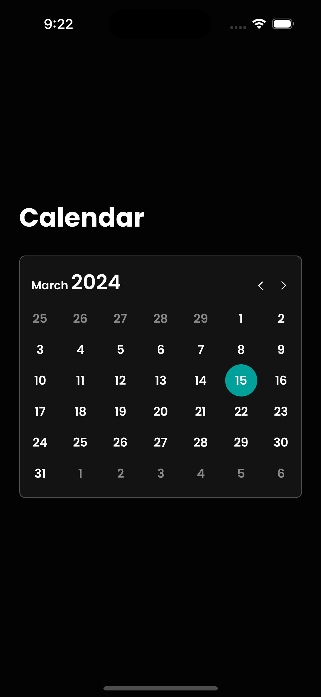

# Heave Calendar

<div>  

</div>

## Stack

* Expo
* Typescript
* react-native-svg

### Setup Instructions

Run the following commands in the root folder of the project

1. Install dependencies

```bash
npm install
```

2. Start the metro bundler

```bash
npm run start
```

3. Read the QR code from the expo app in your device or follow the expo instructions to run the app in a simulator.

**Important**: just be sure to keep you devices in the same network

## How to run tests

```bash
npm run test
```
